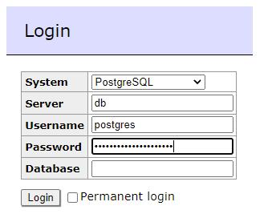

# pg2ts
Convert Postgres Tables to Typescript constants to be used in your SQL queries with a single command:

```npx pg2ts --config pg2ts.json```

[see `pg2ts.json` below](#documentation)

## Use cases
You will want this library if (choose yours):
1) you write SQL in plain text, but despite it's fast, there are errors ➔ prevent typos
2) you don't like ORMs, but you prefer the simplicity of plain SQL, but you don't like errors either 😉
3) you wrote ORMs, but the time spent in the ORM it's 10x the time spent in debugging a plain SQL

Well, pg2ts is here for you. Keep reading.

## The problem

SQL is still the best way to query & CRUD a relational databases.

If you use typescript, then it would be great to make safe queries, 
without the burden of an orm.

The ideal solution would be to write the SQL in plain text and have 
a tool to figure out if everything is ok (syntax, names, etc.)

We are not there yet, but we are not far away.

The best solution for our team was knex (a library to execute query in JS).

However, Knex is missing the part about table and column names.

**pg2ts** is here to help: you specify the connection to the DB, it generates 
all the constants used to write **safe sql**

So instead of an error-prone query like the one below

```typescript
// before pg2ts
await this.db.query(`
select * from my_table
where column = $1
order by another_column asc
`)
```

you can do

```typescript
//after pg2ts
const {my_table} = MyDbTablesData.tableNames // my_db is generated and exported by pg2ts
const {column, another_column} = MyDbTablesData.my_table // column names are saved in the table name
await this.db.query(`
select * from ${my_table} 
where ${column} = $1
orderBy ${another_column} asc
`)
```

or using knex
```typescript


async method(columnValue: string) {
    
    const {my_table} = MyDbTablesData.tableNames
    const {column, another_column} = MyDbTablesData.my_table // column names are saved in the table name
    
    const query = this.knex.
    select("*").
    from(my_table).
    where({column: columnValue}).
    orderBy(another_column, "asc").toSQL()
    return await this.db.query(query.toNative().sql, query.bindings)
    
}


...
// Note that knex needs to be initialized with your DB config. Do it once somewhere:
knex:Knex;

this.knex = knex({
    client: 'pg',
    connection: preferences.db
});
...
```

##Documentation

```npx pg2ts --config pg2ts.json```

where the `pg2ts.json` file contains:

```json
{
  "mainPrefix": "", //optional
  "dest": "./gen/", //where you want to generate the *.ts files
  "db": { // the DB configuration
    "host": "localhost",
    "user": "postgres",
    "password": "a__password_sadf54re3",
    "port": 5432,
    "database": "a_db" 
  }
}

// 👉 Note that if you copy/paste this code you need to delete every comment. Json doesn't like comments 😉 
```
Running this code will generate the desired files.

[//]: # (###Generate at every change and make it part of your development process
npm install + package.json task + watch...)

###Quick test
You may find a docker-compose.yml file in this repo to start a postgres DB
with the same data as the json above 😉

To start the local DB, copy the `docker-compose.yml` file in a folder and run:

```docker-compose up```

Then create some table by going to `localhost:5430` and logging in with the 
following credentials (copy the password from above):



If you want to generate a test db, do it from the GUI or run this SQL:

```sql
CREATE DATABASE testdb;
CREATE TABLE IF NOT EXISTS "users" (
  "id" bigserial NOT NULL,
  PRIMARY KEY ("id"),
  "name" text NOT NULL,
  "data" json NOT NULL
);
```


To stop the DB:

```docker-compose down```

##Requisites

A postgres DB

##Benefits
Obvious benefits are:
- less bug related to typos
- autocomplete

Less obvious benefits:
- you have a shot of your DB into git
- when the DB changes, part of your code having errors gets notified by the compiler
